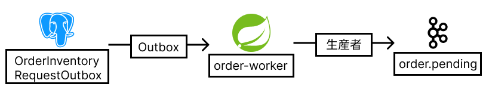

### AWS デプロイアーキテクチャ
- Masterノードを３つ配置する理由はSPOFにさせないためのほか
- 分散システムのSplit Brain現象を防ぐためである

---
### 在庫クエリー
- キャッシュがあれば在庫数の読み込みのスループットは高く維持できる

---
### 在庫クエリーキャッシュミス
- ステートデータベースからのデータソーシングとイベントストアからのイベントソーシング両方の情報を掛け合わせて現在の在庫を計算する必要がある
- Redisのキャッシュ更新は可換性がないため、分散ロックによるロックがいる

---
### 在庫の減少
- 在庫のリレーショナルデータベースの隔離機能を使わず
- Redisのシングルスレッドを用いてluaスクリプト原子的演算で減少させる
- イベントソーシングパタンでイベントの付け加えだけでRDBのIOが済むため
- 非常に高い処理性能とRedisによる低いlatencyが実装できる
- Redisのluaスクリプト原子的演算のおかげで分散ロックが必要ないことになる

---
### 在庫バッチ処理
- イベントソーシングによって積まれたイベント履歴をバッチ処理によってステートデータベースに反映させる
- Redisのキャッシュ更新は可換性がないため、分散ロックによるロックがいる
- そのほか、在庫キャッシュにイベントの連番を含むことで、バッチ上書きによる不具合を未然に防ぐ
- バッチ上書きはRedissonのnon-fairな分散ロックの仕組みから来ている。詳細に関しては下記のリンクを参考にしよう
https://qiita.com/kimyoungho0415/items/bef97541afaff78aa2ee
- メッセージは最少１回発行されるので、何回処理しても演算結果が変わらない冪等性を持たせる必要があるが、引き算・足し算は冪等性がないため、Redis分散ロックを利用した冪等性管理が必要になってくる

---
### 注文生成
- 注文ドメインはOrchestration型Saga等のビジネス処理ロジックのハブになる可能性が高いため
- 「Transactional Outbox」テーブルに情報を入れる

---
### 注文メッセージ
- 注文ドメインはOrchestration型Saga等のビジネス処理ロジックのハブになる可能性が高いため
- 最低１回のメッセージ発信を保証するには「Transactional Outbox」デーブルとスケジューラーを使用する

